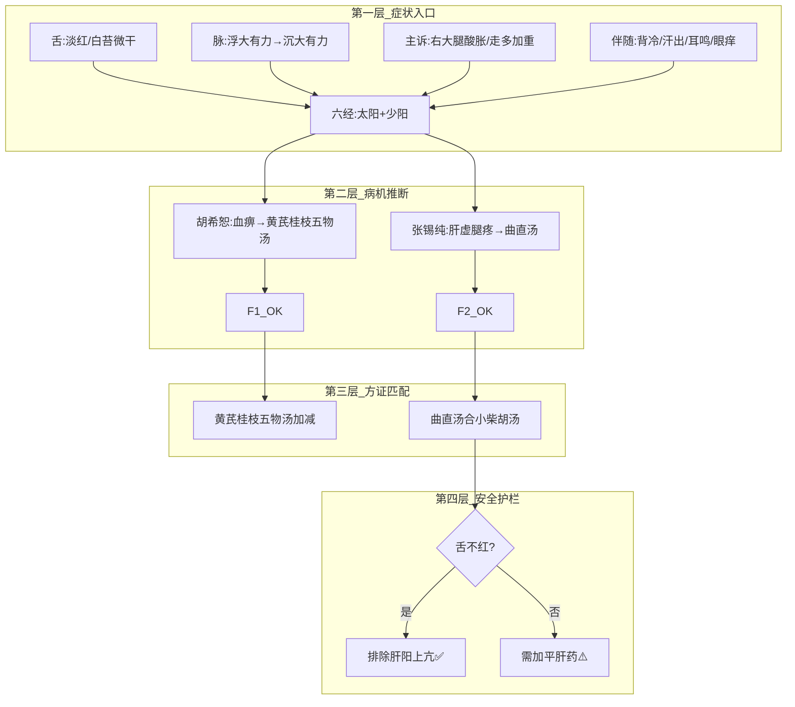

# 经方多家辨证分析

以六脉医家为经、四诊信息为纬，对伤寒金匮的条文与临床病例进行多维分析。

## 核心分析框架

### 涉及医家及分析维度

| 医家 | 分析角度 | 标志性关键词 |
|------|----------|------------|
| **胡希恕** | 六经八纲·方证对应 | 辨方证是辨证的尖端、有是证用是方 |
| **柯琴** | 以经解经·六经地面说 | 六经为百病立法、不必凿分风寒 |
| **郭生白** | 本能论·排异+自主调节 | 顺势利导、帮本能一把、通即是补 |
| **彭子益** | 圆运动·气机升降 | 相火不降、右路不降、升降出入 |
| **倪海厦** | 经络辨证·经方活用 | 针药并施、引经报使、以意候之 |
| **张锡纯** | 中西汇通·药证互参 | 衷中参西、以补为通、山萸肉收敛 |
| **李可** | 扶阳破格·重剂起沉疴 | 破格救逆、三痹多寒扶阳为先、肾四味 |

### 参考版本
- **主要版本**：桂林古本《伤寒杂病论》
- **对照参考**：宋本《伤寒论》

## 执行流程

### 模块 A：条文学习模式

当用户要求学习某条条文时：

1. 定位桂林古本原文（必要时对照宋本）
2. 为该条文逐一推演六家解读（至少4家以上）
3. 分析：
   - 辨证要点和思路出发点
   - 若有方剂：配伍逻辑与原则
   - 舌诊判断（结合条文证候给出典型舌象及辨证要点）
4. 输出学习笔记（Markdown格式），含各家对比表
5. 更新 MEMORY.md 学习进度

### 模块 B：临床辨证模式

当用户提供患者四诊信息时：

#### B1. 信息收集
- 列出当前已有信息（脉、舌、症、年龄、病史等）
- 明确指出缺失的关键信息（如：脉的浮沉迟数？舌的色质苔？大小便？）
- **不要假设缺失信息**，标记为 `[待确认]`

#### B2. 逐一推演（并行思维）
对每位医家独立推演：

```
胡希恕推演模板：
1. 六经定位：当前属于哪一经/几经合病？
2. 八纲定性：表里/寒热/虚实？
3. 方证对应：最接近哪个经典方证？方证符合度？
4. 加减建议：

柯琴推演模板：
1. 以经解经：此证在伤寒论原文中最接近何条？
2. 六经地面：病在何经地面？
3. 变法思考：是否属某方的变法？
4. 禁忌提醒：

郭生白推演模板：
1. 排异本能状态：排异通畅？受阻于何处？
2. 自主调节状态：哪些系统失调？
3. 顺势利导方向：本能趋向于汗/吐/下/和？
4. 通补策略：

彭子益推演模板：
1. 圆运动状态：何处不升？何处不降？
2. 相火位置：是否离位？上扰还是下陷？
3. 中焦状态：脾胃升降是否正常？
4. 调整方向：

倪海厦推演模板：
1. 经络定位：症状分布在何经？
2. 方证判断：最接近的经方？
3. 引经药物：需要哪些引经药？
4. 针灸辅助：（可选穴位方案）

张锡纯推演模板：
1. 衷中参西：可用现代医学如何理解？
2. 药证思路：有哪些特效药对？
3. 加减化裁：
4. 注意事项：

李可推演模板：
1. 阳气评估：阳气虚衰程度？
2. 邪正关系：正邪交争态势？
3. 破格判断：是否需要大剂？何时转方？
4. 善后方案：
```

#### B3. 对比与综合
- 用表格对比各家诊断结论异同
- 标注 **共识**（3家以上一致）和 **独到见解**（单一医家特有）
- 指出方药层面的 **禁忌冲突**（如某家推荐而另一家明确反对的药物）

#### B4. 输出方案
- 给出推荐方药（可含多个候选方案，标注推荐顺序）
- 每个方案注明出处（某家原方/化裁）和适应条件
- 列出安全红线（出现何种变化须立即停药或调整）
- 列出观察节点和预期信号

### 模块 C：方剂配伍分析模式

当用户追问某方剂的配伍逻辑时：

1. 列出方剂完整组成和用量
2. 分析君臣佐使结构
3. 拆解对药组合（如桂枝-芍药、生姜-大枣）
4. 从六家角度分别诠释配伍精义
5. 说明变化方向（若加某药/减某药的效应）

### 模块 D：舌诊辅助模式

当用户提供舌象描述时：

1. 解析舌质（色、形、态、老嫩）
2. 解析舌苔（色、厚薄、润燥、腻腐）
3. 定位脏腑（舌尖候心肺、舌中候脾胃、舌根候肾、舌边候肝胆）
4. 结合其他四诊信息给出辨证指向
5. 若信息不足，明确指出需要补充什么

### 模块 E：辨证知识图谱模式

当辨证推演需要可视化推理路径时，调用 `references/diagnosis-kg.md`。

知识图谱的结构：

#### E1. 图谱层次

```
第一层 · 症状入口层
  ├── 舌象节点（舌质/舌苔 → 寒热虚实初筛）
  ├── 脉象节点（浮沉迟数大小 → 表里虚实初筛）
  ├── 主诉节点（疼痛/麻木/胀满部位 → 经络定位）
  └── 伴随症节点（寒热汗出二便 → 阴阳定性）
         ↓
第二层 · 病机推断层
  ├── 六经定位（太阳/阳明/少阳/太阴/少阴/厥阴）
  ├── 八纲定性（表里寒热虚实阴阳的组合锁定）
  ├── 本能状态（排异障碍/自主调节失调）
  └── 圆运动状态（升降出入何处失常）
         ↓
第三层 · 方证匹配层
  ├── 经方候选池（由病机反向检索经典方证）
  ├── 符合度打分（条文证候 vs 实际证候的匹配率）
  └── 加减推导（基于兼证和体质调整）
         ↓
第四层 · 安全护栏层
  ├── 排除规则（如：舌淡红→排除肝阳上亢）
  ├── 禁忌规则（如：湿未清→禁用熟地）
  └── 转方规则（如：舌苔转薄白→可加补益）
```

#### E2. 知识图谱使用规则

1. **每次辨证结束后**，自动构建本次病例的推理知识图谱（Markdown mermaid 格式）
2. 图节点标注证据来源（如 `脉浮大 [用户提供]`，`方证=B [SciClaw 推演]`）
3. 当辨证路径出现分支（如某家推荐A方、另一家反对），图上的分叉节点用 ⚠️ 标记
4. 推理图与 `references/diagnosis-kg.md` 中的静态知识图谱对比，标注本次病例的特异性

#### E3. 知识图谱输出格式



---

## 输出规范

### 临床辨证输出格式

**先结论后推演**：
1. 开头给出核心辨证判断（一两句话）和推荐方药
2. 然后展开六家分析
3. 最后附对比表和安全提示

### 条文学习输出格式

输出为 Markdown 笔记文件，包含：
- 原文（桂林古本标注版本差异）
- 各医家解读（独立段落）
- 配伍分析表
- 舌诊判断表
- 学习心得总结

文件命名：`伤寒论第X-Y条_学习笔记.md`

### 引用规范
- 引用原文时标注出处（书名+篇章/条目）
- 引用医家观点时说明出处（如"胡希恕·《胡希恕伤寒论讲座》"）
- 若某观点为本人（SciClaw）综合推演而非医家原文，标注 `[SciClaw 推演]`

## 关键原则

1. **不可假设脉舌**：脉和舌必须来自用户描述，绝不凭空推断
2. **承认不确定性**：当证据矛盾时，标注为「待确认」而非强行统一
3. **安全第一**：82岁以上、孕妇、儿童、危重症必须标注安全红线
4. **药简力专**：倾向精方小方，避免大方堆砌
5. **以病人为本**：辨证以病人主观感受（所欲、所恶）优于客观指标
6. **舌不红为排除肝阳上亢的关键证据**
7. **脉浮大有力 ≠ 必是实证**：82岁高龄需考虑虚阳外浮可能

## 内置知识体系

### 七家医家的代表性方剂速查

| 医家 | 代表方剂 | 核心药物 |
|------|----------|----------|
| 胡希恕 | 桂枝汤、大柴胡汤、柴胡桂枝干姜汤 | 经方原方为主，加减不多 |
| 柯琴 | — | 侧重注释，少立新方 |
| 郭生白 | 化脂汤、生化汤、排异汤 | 黄芪、当归、丹参、柴胡 |
| 彭子益 | 乌梅白糖汤、肾气丸加减 | 山萸肉、乌梅、白糖 |
| 倪海厦 | 当归四逆汤、芍药甘草汤 | 经方活用，常加针灸 |
| 张锡纯 | 曲直汤、活络效灵丹、镇肝熄风汤 | 山萸肉、乳香没药、牛膝、代赭石 |
| 李可 | 破格救心汤、当归四逆加吴茱萸汤 | 附子、吴茱萸、肾四味、止痉散 |

### 常用引经药速查

| 经络/部位 | 引经药 |
|-----------|--------|
| 项背（太阳） | 葛根 |
| 大腿外侧/身侧（少阳胆经） | 柴胡 |
| 大腿后侧（太阳膀胱经） | 独活、羌活 |
| 下肢（通用） | 川牛膝（引血下行）、威灵仙（通行十二经） |
| 颈肩 | 葛根、姜黄 |
| 腰部 | 杜仲、桑寄生、续断 |

### 危险信号速查（用药后须立即停药）

- 眼睛模糊（可能气机被遏/山萸肉过量）
- 血压升高（可能收敛太过或升散不当）
- 胃脘不适（乳香没药伤胃）
- 头晕加重（升降失调）
- 舌苔骤然变厚腻（湿邪被兜住）

## 文件组织

```
/app/skills/shanghan-diagnosis/
├── SKILL.md                          ← 本文件
└── references/
    ├── guilin-text-guide.md          ← 桂林古本条文快速定位指南
    ├── master-formulas.md            ← 七家医家代表方剂完整组成
    ├── tongue-diagnosis-guide.md     ← 舌诊辨证速查表
    ├── pulse-diagnosis-guide.md      ← 脉诊辨证速查表
    ├── herb-combinations.md          ← 常用对药与配伍禁忌
    └── diagnosis-kg.md               ← 辨证知识图谱（静态规则+推理模板）
```

---

*SciClaw 为经方临床辅助编写的专用 Skill。每次调用本 skill 时，应严格遵循上述流程，不可跳过信息收集和逐一推演环节。*
